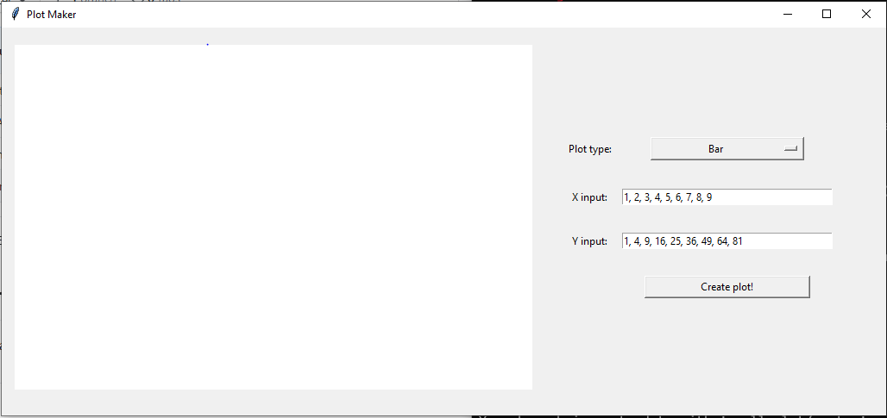

# Small-Plot-Maker
A small GUI application that makes basic plots

# How to 
Is a small program. Right now you have to go to your shell and type 

`python home_gui.py`

There you'll see an image like this

After that you can click on "create plot!" and you'll see a small barplot like the one below:

Basically you can add values separated by commas in both the X and Y entries. You can select from a dropdown menu to see barplots, lineplots and pieplots.
Right now the use is very limited but I'm willing to make it a bit better.

